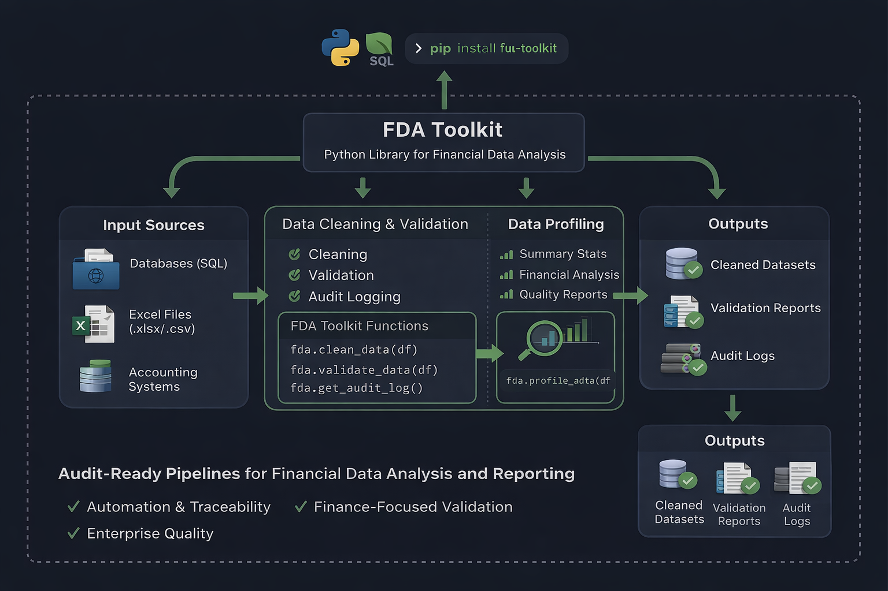

<h1 align="center">
  
</h1>

<p align="center">
  <em>ACA Chartered Accountant &amp; Microsoft Certified Power BI Data Analyst — building audit-ready financial pipelines with Python, SQL, and Power BI &nbsp;·&nbsp; Open to Finance &amp; Data Analyst roles in the UK.</em>
</p>

<p align="center">
  <a href="https://www.linkedin.com/in/adeyanjuteslimuthman">
    
  </a>
  &nbsp;
  <a href="https://github.com/TeslimAdeyanju">
    
  </a>
  &nbsp;
  <a href="https://adeyanjuteslim.co.uk">
    
  </a>
  &nbsp;
  <a href="https://pypi.org/project/fda-toolkit/">
    
  </a>
  &nbsp;
  <a href="https://wakatime.com/@TeslimAdeyanju">
    
  </a>
  &nbsp;
  <a href="https://learn.microsoft.com/en-us/credentials/certifications/data-analyst-associate/">
    
  </a>
</p>

---

## About Me

I am a Chartered Accountant, Microsoft Certified Power BI Data Analyst (PL-300), and Financial Data Analyst with over a decade of experience across financial reporting, FP&A, and data analytics.

My work focuses on transforming traditional finance environments into structured, automated, and traceable analytical systems using Python, SQL, and Power BI.

I design solutions that replace spreadsheet driven processes with controlled pipelines that improve accuracy, speed, and decision confidence.

My approach combines accounting discipline with data engineering practices to ensure financial outputs remain reliable, explainable, and scalable.

> 💡 **Philosophy:** Good data engineering makes good analysis simple. Clean data, reliable pipelines, audit trails built in.

---

## Qualifications & Certifications

- MSc Finance and Investment Banking (with Advanced Research) — Distinction · University of Hertfordshire, UK · 2024
- ACA — Associate Chartered Accountant · Institute of Chartered Accountants of Nigeria · 2019
- Microsoft Certified: Power BI Data Analyst Associate (PL-300) · 2026
- Xero Certified Advisor
- SQL & Database Design
- Python for Data Analysis

---

## Core Expertise

- Financial Planning and Analysis
- Budgeting, Forecasting, and Variance Analysis
- Reporting Automation and Process Optimisation
- Data Modelling for Financial Analytics
- Audit Ready Analytics and Control Frameworks
- Performance Management and Decision Support

---

## Technical Stack

<h4 align="center">Languages</h4>
<p align="center">
  
  
  
  
</p>

<h4 align="center">Data, ML & Analytics</h4>
<p align="center">
  
  
  
  
  
  
  
  
</p>

<h4 align="center">Databases</h4>
<p align="center">
  
  
</p>

<h4 align="center">BI & Reporting</h4>
<p align="center">
  
  
  
</p>

<h4 align="center">Tools & Workflow</h4>
<p align="center">
  
  
  
  
</p>

---

## What I Do Differently

I treat financial analysis as an engineering discipline rather than a reporting activity.

I build systems that are traceable, reusable, auditable, and performance optimised — designed for scale rather than manual maintenance.

This allows organisations to move from static reporting to insight driven decision making supported by controlled data pipelines.

---

## Open Source Project Lead

### [FDA Toolkit](https://github.com/TeslimAdeyanju/Financial-Data-Analysis-Toolkit-Workspace) — Enterprise Financial Data Toolkit

[](https://pypi.org/project/fda-toolkit/)
[](https://pypi.org/project/fda-toolkit/)
[](https://pypi.org/project/fda-toolkit/)
[](https://pypi.org/project/fda-toolkit/)

I am the creator and maintainer of **FDA Toolkit**, an open source Python project I architected and developed to solve real world challenges in financial data analysis.

The toolkit enables financial analysts, accountants, and data professionals to produce reliable, auditable, and repeatable analytics by replacing fragile spreadsheet driven processes with structured validation, transformation, and reporting pipelines designed for production use.

**Key Features**

- 67 production ready functions organised across 8 modular components
- Full type hinting with IDE level autocomplete and validation
- Compliance focused design with automatic audit logging and traceability
- Finance aware validation tailored to real accounting and FP&A workflows
- One line pipelines for complex transformations such as `ftk.quick_clean_finance()`
- Enterprise grade engineering including structured error handling, security controls, and memory efficiency

**Install:**
```bash
pip install fda-toolkit
```



[View on PyPI](https://pypi.org/project/fda-toolkit/) &nbsp;•&nbsp; [GitHub Repository](https://github.com/TeslimAdeyanju/Financial-Data-Analysis-Toolkit-Workspace)

---

## Selected Portfolio Work

<table>
  <thead>
    <tr>
      <th width="190">Project</th>
      <th width="200">Tech Stack</th>
      <th width="370">Impact</th>
      <th width="140">Link</th>
    </tr>
  </thead>
  <tbody>
    <tr>
      <td><strong>NHS Trust Financial Analytics</strong></td>
      <td>Python, MySQL, SQL, Power BI</td>
      <td>End-to-end ETL pipeline covering 206 NHS Trusts across 3 financial years — star schema, KPI views, Power BI export</td>
      <td><a href="https://github.com/TeslimAdeyanju/portfolio-01-nhs-financial-analytics">View Project</a></td>
    </tr>
    <tr>
      <td><strong>Financial Data Pipeline</strong></td>
      <td>Python, APIs, Pandas, Forecasting</td>
      <td>Full pipeline from API extraction to data cleaning, automated forecasting, trading simulation, and deployment</td>
      <td><a href="https://github.com/TeslimAdeyanju/portfolio-02-financial-data-pipeline">View Project</a></td>
    </tr>
    <tr>
      <td><strong>Stock Market Analysis — Tech Giants</strong></td>
      <td>Python, Pandas, NumPy, Monte Carlo</td>
      <td>Analysed GOOGL, AMZN, AAPL and MSFT — daily returns, Sharpe ratio, volatility, and 30-year Monte Carlo projection</td>
      <td><a href="https://github.com/TeslimAdeyanju/portfolio-03-stock-market-analysis">View Project</a></td>
    </tr>
    <tr>
      <td><strong>ML in Financial Analysis</strong></td>
      <td>Python, Scikit-learn, XGBoost, Kubernetes</td>
      <td>Regression for trend prediction, classification for risk assessment, ensemble models for portfolio optimisation</td>
      <td><a href="https://github.com/TeslimAdeyanju/portfolio-07-ml-financial-analysis">View Project</a></td>
    </tr>
    <tr>
      <td><strong>Diamond Price Prediction</strong></td>
      <td>Python, Scikit-learn, Pandas, EDA</td>
      <td>End-to-end ML project covering EDA, feature engineering, and supervised learning to predict diamond prices</td>
      <td><a href="https://github.com/TeslimAdeyanju/portfolio-08-diamond-price-prediction">View Project</a></td>
    </tr>
    <tr>
      <td><strong>MySQL — Fundamentals to Advanced</strong></td>
      <td>MySQL, Python, Jupyter</td>
      <td>Comprehensive MySQL showcase covering advanced queries, stored procedures, and Python integration for live data frames</td>
      <td><a href="https://github.com/TeslimAdeyanju/portfolio-21-mysql-fundamentals">View Project</a></td>
    </tr>
    <tr>
      <td><strong>Student Wellbeing Analytics</strong></td>
      <td>MySQL, Advanced SQL, Jupyter</td>
      <td>Advanced SQL portfolio covering multi-table analysis, window functions, and insight delivery on student wellbeing data</td>
      <td><a href="https://github.com/TeslimAdeyanju/portfolio-06-student-wellbeing-sql">View Project</a></td>
    </tr>
  </tbody>
</table>

---

## GitHub Activity

<p align="center">
  
  &nbsp;
  
</p>

---

## Coding Activity — WakaTime

<p align="center">
  <a href="https://wakatime.com/@TeslimAdeyanju">
    
  </a>
</p>

<!--START_SECTION:waka-->

```txt
From: 17 March 2026 - To: 23 March 2026

Total Time: 22 hrs 26 mins

Other      15 hrs 36 mins        █████████████████▒░░░░░░░   69.50 %
Python     3 hrs 52 mins         ████▒░░░░░░░░░░░░░░░░░░░░   17.27 %
Bash       1 hr 4 mins           █▒░░░░░░░░░░░░░░░░░░░░░░░   04.80 %
Markdown   52 mins               █░░░░░░░░░░░░░░░░░░░░░░░░   03.88 %
CSV        30 mins               ▓░░░░░░░░░░░░░░░░░░░░░░░░   02.28 %
```

<!--END_SECTION:waka-->

---

## Connect

<p align="center">
  <a href="https://www.linkedin.com/in/adeyanjuteslimuthman">
    
  </a>
  &nbsp;
  <a href="https://github.com/TeslimAdeyanju">
    
  </a>
  &nbsp;
  <a href="https://adeyanjuteslim.co.uk">
    
  </a>
  &nbsp;
  <a href="https://wakatime.com/@TeslimAdeyanju">
    
  </a>
  &nbsp;
  <a href="https://pypi.org/project/fda-toolkit/">
    
  </a>
</p>
