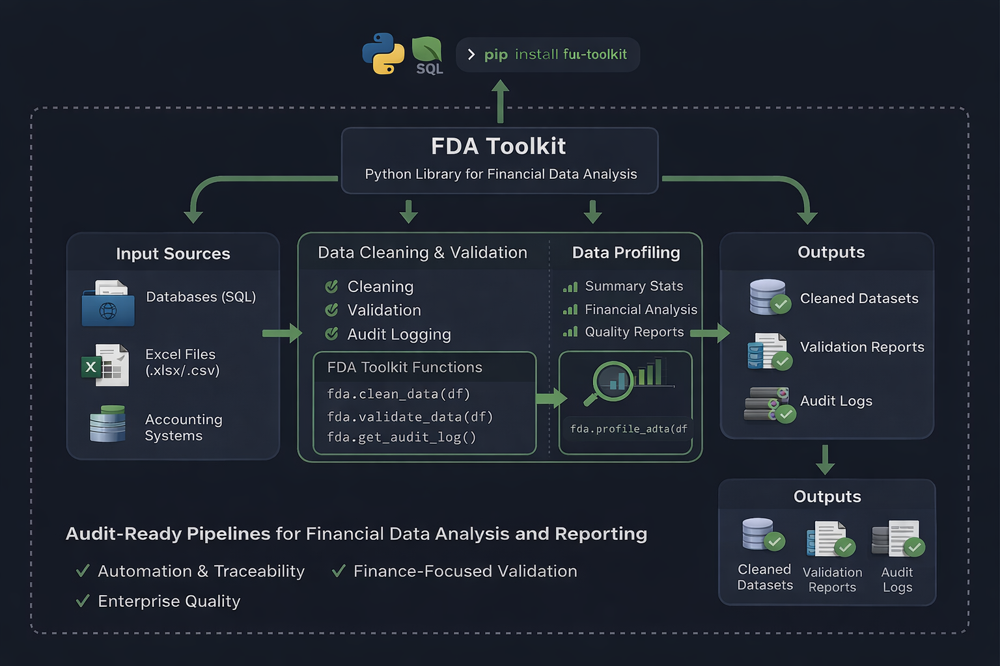

<h1 align="center">
  
</h1>

<p align="center">
  <em>Microsoft Certified: Power BI Data Analyst Associate (PL-300) &amp; Azure Data Fundamentals (DP-900) · ACA Chartered Accountant · Transforming finance through Power BI, SQL, Python, Microsoft Fabric and Azure data services.</em>
</p>

<p align="center">
  <a href="https://www.linkedin.com/in/adeyanjuteslimuthman">
    
  </a>
  &nbsp;
  <a href="https://github.com/TeslimAdeyanju">
    
  </a>
  &nbsp;
  <a href="https://adeyanjuteslim.co.uk">
    
  </a>
  &nbsp;
  <a href="https://pypi.org/project/fda-toolkit/">
    
  </a>
  &nbsp;
  <a href="https://learn.microsoft.com/en-us/credentials/certifications/data-analyst-associate/">
    
  </a>
  &nbsp;
  <a href="https://learn.microsoft.com/en-us/credentials/certifications/azure-data-fundamentals/">
    
  </a>
</p>


---

## About Me

I am a Financial Data Analyst, ACA Chartered Accountant, and Microsoft Certified: Power BI Data Analyst Associate (PL-300) and Azure Data Fundamentals (DP-900) professional, with over a decade of experience in financial reporting, FP&amp;A and data analytics.

I help organisations turn complex financial data into trusted, decision-ready insight. I combine finance and accounting expertise with Power BI, Microsoft Fabric, Azure data services, SQL and Python to improve reporting quality, automate repeatable processes and strengthen financial controls.

I build Power BI semantic models, star-schema data models, SQL data pipelines and Python-enabled financial workflows. My focus is reliable, scalable and auditable reporting—helping finance teams move beyond spreadsheet-led processes towards governed self-service analytics.

> 💡 **Approach:** Finance expertise first; data and automation as the enablers. Clean data, controlled processes and transparent logic make better financial decisions possible.

---

## Qualifications & Certifications
- Microsoft Certified: Power BI Data Analyst Associate (PL-300) · 2026
- Microsoft Certified: Azure Data Fundamentals (DP-900) · 2026
- MSc Finance and Investment Banking (with Advanced Research) — Distinction · University of Hertfordshire, UK · 2024
- ACA — Associate Chartered Accountant · Institute of Chartered Accountants of Nigeria · 2019
- Databricks Accredited: Lakehouse Platform Fundamentals · 2026
- Databricks Generative AI Fundamentals · 2026
- Xero Certified Advisor · 2025
- SQL (Advanced) — HackerRank · 2026
- Python for Data Analysis — SuperDataScience · 2025

---

## Core Expertise

- Financial Planning and Analysis
- Budgeting, Forecasting, and Variance Analysis
- Reporting Automation and Process Optimisation
- Data Modelling for Financial Analytics
- Audit Ready Analytics and Control Frameworks
- Performance Management and Decision Support

---

## Technical Stack

<h4 align="center">Languages</h4>
<p align="center">
  
  
  
  
</p>

<h4 align="center">Data, ML & Analytics</h4>
<p align="center">
  
  
  
  
  
  
  
  
</p>

<h4 align="center">Databases</h4>
<p align="center">
  
  
</p>

<h4 align="center">BI & Reporting</h4>
<p align="center">
  
  
  
</p>

<h4 align="center">Tools & Workflow</h4>
<p align="center">
  
  
  
  
</p>

---

## Open Source Project Lead

### [FDA Toolkit](https://github.com/TeslimAdeyanju/Financial-Data-Analysis-Toolkit-Workspace) — Enterprise Financial Data Toolkit

[](https://pypi.org/project/fda-toolkit/)
[](https://pypi.org/project/fda-toolkit/)
[](https://pypi.org/project/fda-toolkit/)
[](https://pypi.org/project/fda-toolkit/)

I am the creator and maintainer of **FDA Toolkit**, an open source Python project I architected and developed to solve real world challenges in financial data analysis.

The toolkit enables financial analysts, accountants, and data professionals to produce reliable, auditable, and repeatable analytics by replacing fragile spreadsheet driven processes with structured validation, transformation, and reporting pipelines designed for production use.

**Financial analytics capabilities**
- Clean, standardise and validate financial datasets before reporting or analysis
- Support reconciliations, data-quality checks and traceable financial workflows
- Automate repeatable finance and FP&A analysis tasks using reusable Python functions
- Apply audit logging and consistent error handling to strengthen operational control
- Provide one-line utility workflows, including `ftk.quick_clean_finance()`
- Support integration with SQL, Power BI and broader financial-data pipelines

**Install:**
```bash
pip install fda-toolkit
```



[View on PyPI](https://pypi.org/project/fda-toolkit/) &nbsp;•&nbsp; [GitHub Repository](https://github.com/TeslimAdeyanju/Financial-Data-Analysis-Toolkit-Workspace)

---

## Selected Portfolio Work

<table>
  <thead>
    <tr>
      <th width="190">Project</th>
      <th width="200">Tech Stack</th>
      <th width="370">Impact</th>
      <th width="140">Link</th>
    </tr>
  </thead>
  <tbody>
    <tr>
      <td><strong>NHS Trust Financial Analytics</strong></td>
      <td>Python, MySQL, SQL, Power BI</td>
      <td>End-to-end ETL pipeline covering 206 NHS Trusts across 3 financial years — star schema, KPI views, Power BI export</td>
      <td><a href="https://github.com/TeslimAdeyanju/portfolio-01-nhs-trust-financial-analytics">View Project</a></td>
    </tr>
    <tr>
      <td><strong>Financial Report Intelligence System</strong></td>
      <td>Python, Multi-Agent AI, LLM</td>
      <td>Multi-agent AI platform that extracts financial metrics, flags risk signals, and generates evidence-based commentary from corporate reports</td>
      <td><a href="https://github.com/TeslimAdeyanju/portfolio-26-Financial-Report-Intelligence-System">View Project</a></td>
    </tr>
    <tr>
      <td><strong>Advanced SQL — Cohort Risk Segmentation</strong></td>
      <td>MySQL, Advanced SQL, Jupyter</td>
      <td>Enterprise-grade SQL (25+ queries, window functions, CTEs) segmenting international student risk cohorts from mental health outcome data</td>
      <td><a href="https://github.com/TeslimAdeyanju/portfolio-06-advanced-sql-analytics-international-cohort-risk-segmentation">View Project</a></td>
    </tr>
    <tr>
      <td><strong>Financial Data Pipeline</strong></td>
      <td>Python, APIs, Pandas, Forecasting</td>
      <td>Full pipeline from API extraction to data cleaning, automated forecasting, trading simulation, and deployment</td>
      <td><a href="https://github.com/TeslimAdeyanju/portfolio-02-financial-data-pipeline">View Project</a></td>
    </tr>
    <tr>
      <td><strong>ML in Financial Analysis</strong></td>
      <td>Python, Scikit-learn, XGBoost, Kubernetes</td>
      <td>Regression for trend prediction, classification for risk assessment, ensemble models for portfolio optimisation</td>
      <td><a href="https://github.com/TeslimAdeyanju/portfolio-07-ml-financial-analysis">View Project</a></td>
    </tr>
    <tr>
      <td><strong>Stock Market Analysis — Tech Giants</strong></td>
      <td>Python, Pandas, NumPy, Monte Carlo</td>
      <td>Analysed GOOGL, AMZN, AAPL and MSFT — daily returns, Sharpe ratio, volatility, and 30-year Monte Carlo projection</td>
      <td><a href="https://github.com/TeslimAdeyanju/portfolio-03-stock-market-analysis">View Project</a></td>
    </tr>
    <tr>
      <td><strong>MySQL — Fundamentals to Advanced</strong></td>
      <td>MySQL, Python, Jupyter</td>
      <td>Comprehensive MySQL showcase covering advanced queries, stored procedures, and Python integration for live data frames</td>
      <td><a href="https://github.com/TeslimAdeyanju/portfolio-21-mysql-fundamentals">View Project</a></td>
    </tr>
  </tbody>
</table>

---

## GitHub Activity

<p align="center">
  
  &nbsp;
  
</p>

---

## Coding Activity — WakaTime

<p align="center">
  <a href="https://wakatime.com/@TeslimAdeyanju">
    
  </a>
</p>

<!--START_SECTION:waka-->

```txt
From: 23 August 2026 - To: 30 August 2026

Total Time: 44 hrs 38 mins

Other        31 hrs 29 mins        █████████████████▓░░░░░░░   70.56 %
Markdown     4 hrs 33 mins         ██▓░░░░░░░░░░░░░░░░░░░░░░   10.22 %
CSS          3 hrs 59 mins         ██▒░░░░░░░░░░░░░░░░░░░░░░   08.95 %
HTML         2 hrs 32 mins         █▒░░░░░░░░░░░░░░░░░░░░░░░   05.71 %
XML          51 mins               ▒░░░░░░░░░░░░░░░░░░░░░░░░   01.94 %
```

<!--END_SECTION:waka-->

---

## Connect

<p align="center">
  <a href="https://www.linkedin.com/in/adeyanjuteslimuthman">
    
  </a>
  &nbsp;
  <a href="https://github.com/TeslimAdeyanju">
    
  </a>
  &nbsp;
  <a href="https://adeyanjuteslim.co.uk">
    
  </a>
  &nbsp;
  <a href="https://wakatime.com/@TeslimAdeyanju">
    
  </a>
  &nbsp;
  <a href="https://pypi.org/project/fda-toolkit/">
    
  </a>
</p>
